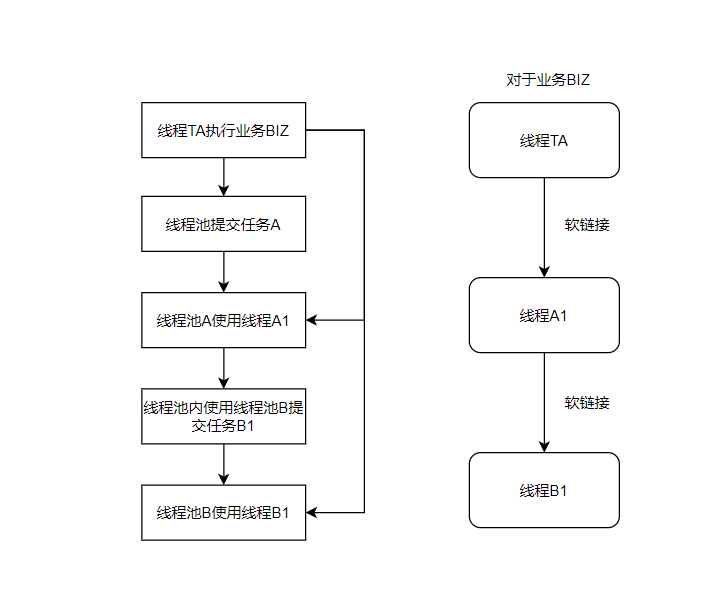

# artisticode
artisticode

请先仔细查看master branch的README.md

操作简要指导:
- fork 之后拉取main分支
- new branch 新的分支(命名规则以题目说明为基准)
- 将artisticode-dependencies install 本地maven仓库
- coding
- push 新的分支
- 请求合并

### 时间: 2021 10月1号-10月15号
### 题目:
小明同学的业务中有很多多线程的操作，部分业务中不同的线程执行时还需要相互关联，但是每个线程无法感知到其他线程池中线程的状态，也无法对其进行操作。为此小明设计了线程状态控制器：

### 线程关联关系

### 要求:

1. 对于任意线程均可以注册到控制器中.
2. 对于任意线程可以获取任意线程的状态和其正在执行的业务线类型.
3. 任意线程可获取任意线程所在的线程池.
4. 任意线程可获取当前线程软关联的所有线程.
5. 线程链路根据业务线相互隔离
6. 线程之间操作必须保证线程安全
7. 完善ThreadStateManager类中的方法

### 相关类的设计请放在thread.state包下

### 本次奖励内容:微信红包(XX￥)
